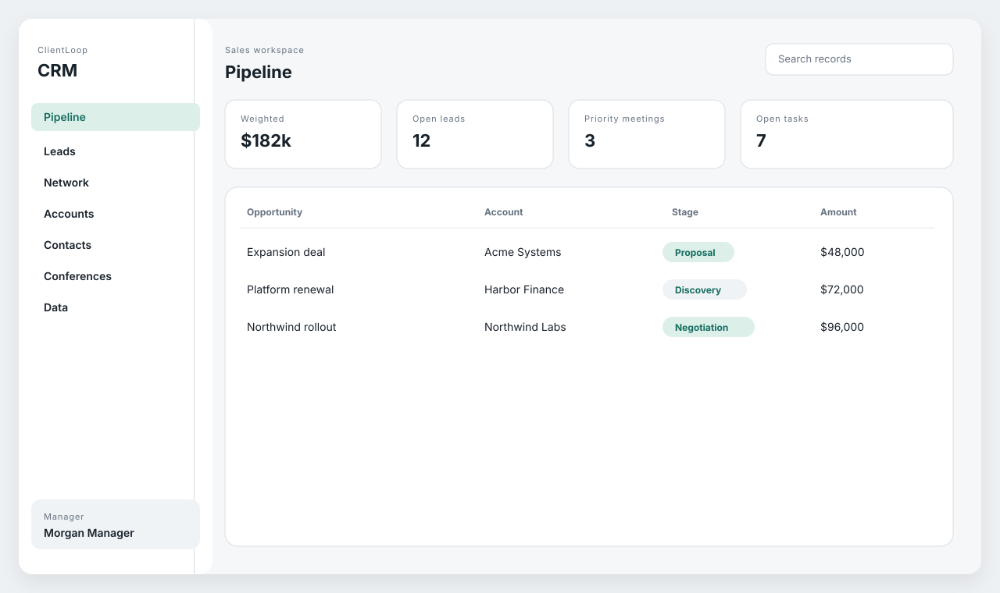
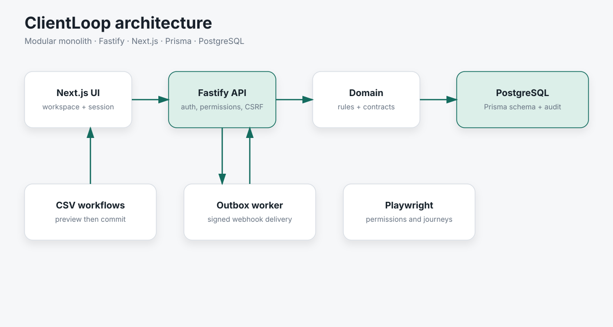

# ClientLoop

TypeScript CRM modular monolith with Fastify, Next.js, Prisma, permissions, outbox delivery, and Playwright.

Portfolio project using fictional data. It is not connected to an employer, client, or production system.

[](https://github.com/damian123/clientloop/actions/workflows/ci.yml)





## Capabilities

- Shared domain, Zod contracts, OpenAPI, and a bounded read-only GraphQL detail endpoint
- Fastify API with object-level permissions, optimistic concurrency, idempotency, audit fields, and a signed webhook outbox
- Next.js workspace with pipeline, records, tasks, timeline, search, CSV import/export, and role-aware controls
- Prisma/PostgreSQL schema for tenants, users, CRM records, custom fields, audit logs, and outbox events
- Conference prospecting with scoring, lawful-basis checks, opt-out enforcement, and CSV templates
- Playwright coverage for permissions, timeline, pipeline, and import workflows

## Run in two minutes

```bash
npm ci
CRM_REPOSITORY=memory npm run dev:api
npm run dev:web
```

Open [http://localhost:3000](http://localhost:3000). Local browser sessions use:

```bash
curl -i -X POST http://localhost:4000/v1/session/dev-login \
  -H 'Content-Type: application/json' \
  -d '{}'
```

The API defaults to port 4000 and the web app to port 3000. Mutating cookie-backed requests must send the matching `X-CSRF-Token` header.

### Production OIDC login

The API supports an OpenID Connect authorization-code BFF flow with PKCE,
`state`, `nonce`, a signed short-lived transaction cookie, verified ID-token
claims, and an allowlisted local redirect. Configure:

```bash
OIDC_ISSUER="https://identity.example/"
OIDC_CLIENT_ID="clientloop"
OIDC_CLIENT_SECRET="replace-with-provider-secret"
OIDC_REDIRECT_URI="https://crm.example/v1/session/oidc/callback"
OIDC_TENANT_ID="00000000-0000-4000-8000-000000000001"
SESSION_SIGNING_SECRET="replace-with-at-least-32-random-bytes"
ALLOW_HEADER_AUTH=false
ALLOW_DEV_LOGIN=false
```

Start login at `/v1/session/oidc/login?returnTo=/`. The provider must return a
verified `email` claim matching an active user in the configured tenant. The
flow never provisions users or accepts a tenant from identity-provider claims.

### GraphQL record details

`POST /graphql` is an authenticated, read-only endpoint for dense account,
contact, lead, and opportunity detail screens. It returns the selected record,
linked account/contact/opportunities, timeline items, and applicable custom
field definitions. Query text and selected-field counts are bounded, and
cookie-authenticated POSTs require the same CSRF header as REST mutations.

```graphql
query AccountDetail($id: ID!) {
  recordDetail(entityType: ACCOUNT, id: $id) {
    account { id name status customFields }
    contacts { id firstName lastName }
    opportunities { id name stage amount currency }
    tasks { id title status }
    notes { id body }
    activities { id subject occurredAt }
  }
}
```

### PostgreSQL path

```bash
cp .env.example .env
docker compose up -d
npm run prisma:migrate
npm run prisma:seed
```

`DATABASE_URL` selects Prisma. `CRM_REPOSITORY=memory` keeps tests and demos off the database.

## Verification and CI

```bash
npm run typecheck
npm test
npm exec playwright install chromium
npm run test:e2e
npm run build
```

`.github/workflows/ci.yml` runs the production dependency audit, typecheck, unit/API tests, Playwright, and production build on `main` and pull requests.

## Design decisions

- Permissions are object-scoped and enforced in the API, then reflected in the UI from session metadata.
- Record updates use optimistic concurrency (`expectedVersion`) rather than last-write-wins.
- Domain events are written to an outbox in the same unit of work; a worker delivers signed webhooks with retry.
- Conference scoring is a pure domain function with explicit bands; opted-out people cannot enter outreach states.
- Custom fields, CSV import preview, and Playwright permission cases are first-class rather than afterthoughts.
- OIDC identities map only to existing active tenant users; GraphQL deliberately has no mutation type.

See [LIMITATIONS.md](LIMITATIONS.md) and [SECURITY.md](SECURITY.md).
